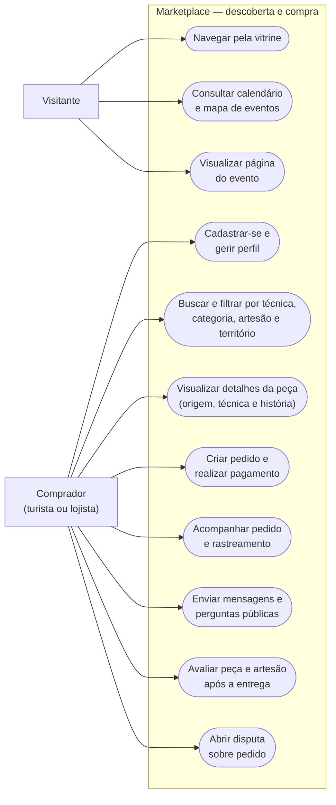
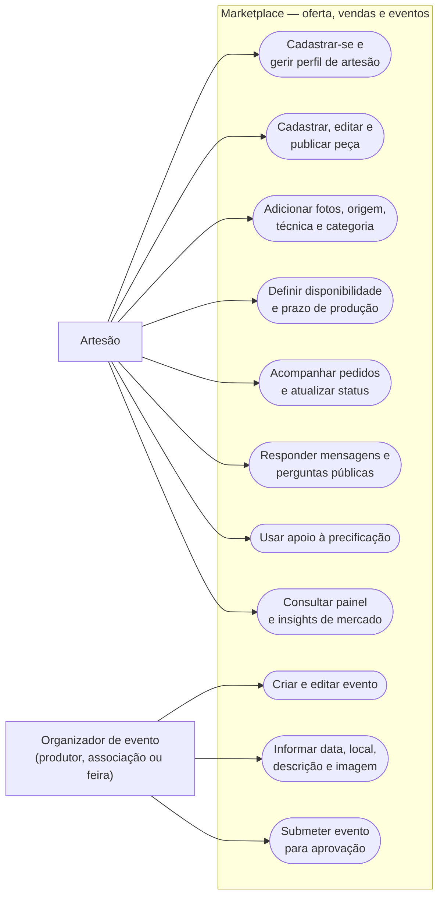
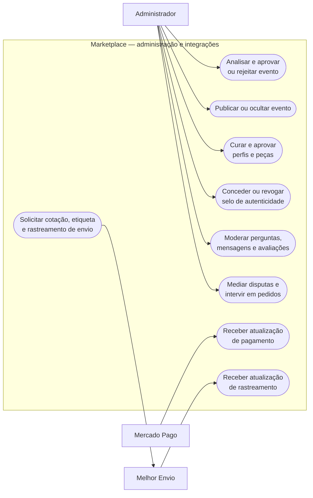

# Casos de uso detalhados — páginas complementares para draw.io

Importe os três diagramas abaixo em páginas separadas. Cada página mostra as
ações concretas de um conjunto de atores e evita linhas cruzadas.

## Página 1 — visitante e comprador

## Página 2 — artesão e organizador de evento

## Página 3 — administrador e integrações externas

## Ordem de apresentação

1. **Página 1:** visitante e comprador.
2. **Página 2:** artesão e organizador de evento.
3. **Página 3:** administrador e integrações.

Use A0 horizontal somente se a entrega for impressa. Para uma entrega digital,
A3 horizontal é suficiente e deixa as três páginas mais proporcionais.
