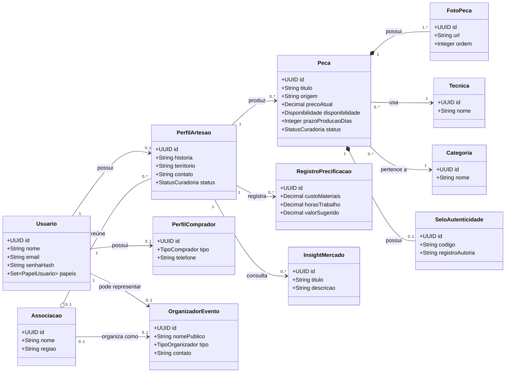
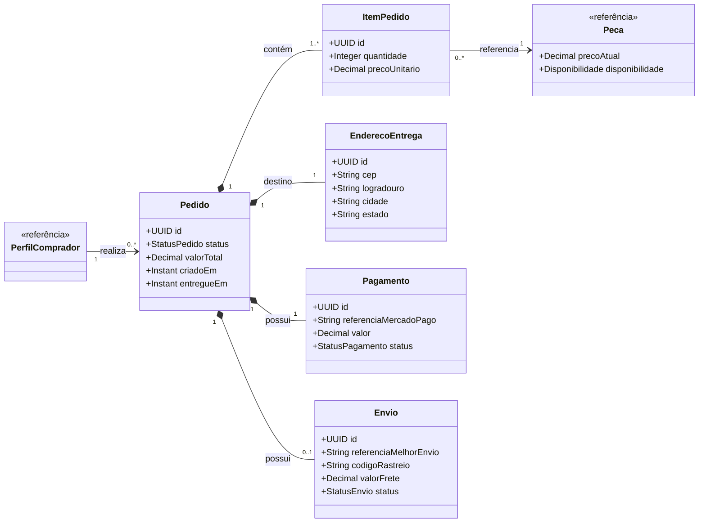
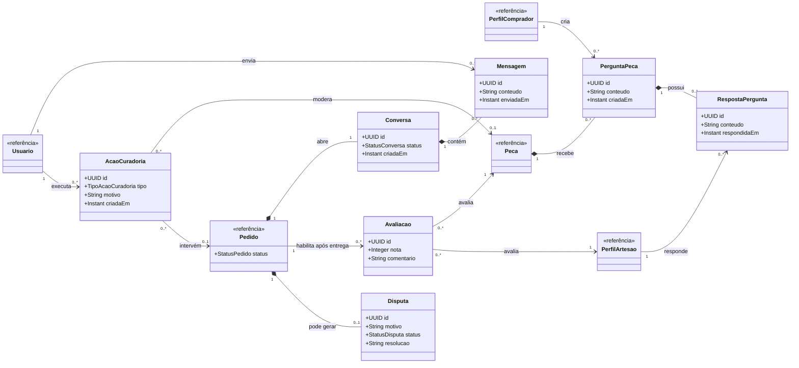
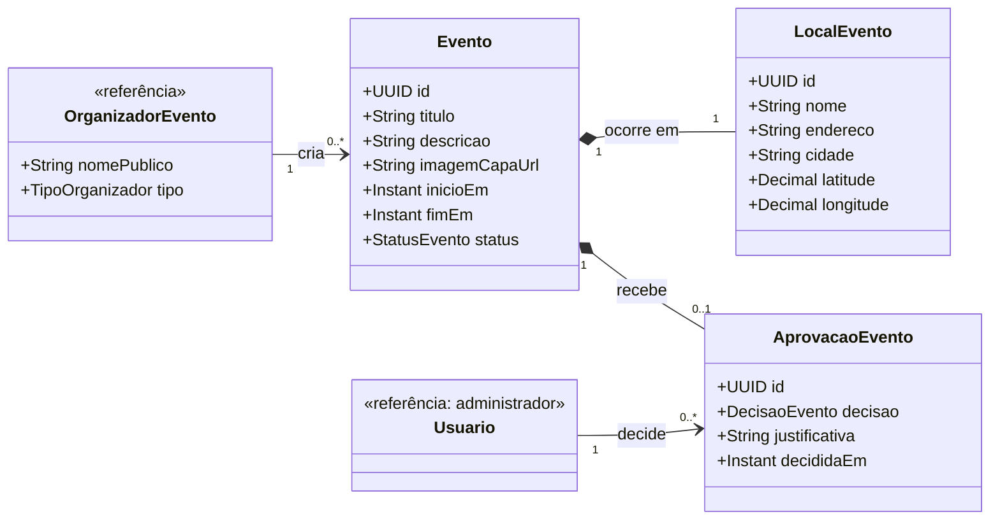

# Diagramas de classes por contexto — draw.io

Importe cada bloco em uma página diferente do draw.io. As classes repetidas como
`<<referência>>` existem apenas para deixar claras as ligações entre contextos;
no sistema elas são uma única classe compartilhada.

## Página 1 — pessoas, catálogo e oferta

## Página 2 — pedido, pagamento e envio

> `ItemPedido.precoUnitario` preserva o preço acertado na compra, mesmo se o
> valor atual da peça mudar. Pagamento e envio guardam referências externas,
> sem trazer classes ou SDKs dos provedores para o domínio.

## Página 3 — comunicação, confiança e curadoria

## Página 4 — eventos e aprovação

> Calendário, mapa e página do evento são visualizações de `Evento` e
> `LocalEvento`; não são classes do domínio. Um evento só aparece publicamente
> quando seu `StatusEvento` é `PUBLICADO`, após uma aprovação.

## Importação

1. Crie quatro páginas no draw.io, uma para cada seção acima.
2. Use **Ordenar → Inserir → Mermaid → Diagram**.
3. Cole apenas um bloco `classDiagram` por página, sem as crases.
4. Use **A3 horizontal** para entrega digital; escolha A0 apenas se o trabalho
   for impresso em formato grande.
