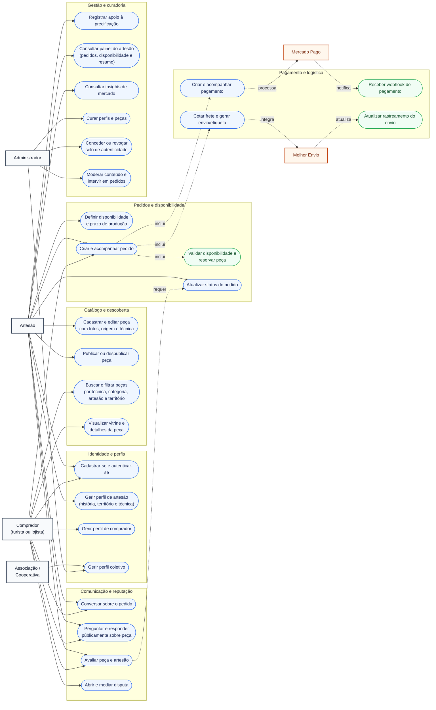
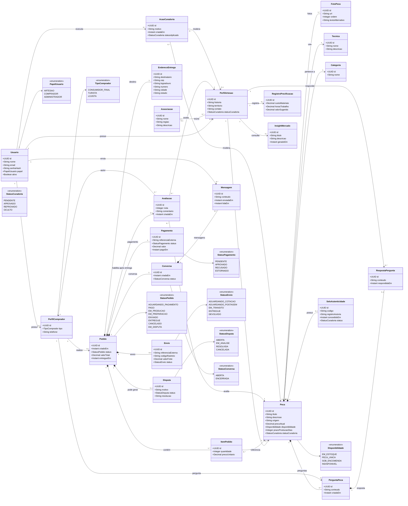

# Diagramas do Marketplace de Artesanato de Pernambuco

Os diagramas abaixo representam o modelo de domínio da aplicação. O PostgreSQL é
a única base de dados transacional; imagens são mantidas em armazenamento de
objetos. Mercado Pago e Melhor Envio são integrações externas, encapsuladas no
backend por adaptadores.

## Casos de uso

> A avaliação só é habilitada quando o pedido está no estado `ENTREGUE`; essa
> pré-condição é representada pela dependência entre avaliação e atualização do
> pedido.

### Rastreabilidade de requisitos funcionais

| Requisitos | Casos de uso que os representam |
| --- | --- |
| RF-01, RF-02, RF-15 | UC01 a UC04 — autenticação e perfis individual/coletivo |
| RF-03, RF-04, RF-05 | UC05 a UC08 — catálogo, vitrine e descoberta |
| RF-06, RF-07 | UC09 a UC12 — disponibilidade, pedido e seus estados |
| RF-08, RF-17 | UC13 e UC14 — conversa privada e perguntas públicas |
| RF-09, RF-13, RF-14 | UC17 a UC19 — precificação, painel e insights |
| RF-10, RF-18 | UC23 a UC26 — pagamento, frete e rastreamento |
| RF-11, RF-12 | UC15 e UC21 — avaliações e selo de autenticidade |
| RF-16, RF-19 | UC16, UC20 e UC22 — disputas, curadoria e intervenção |

## Classes de domínio

## Regras representadas

- A reserva e a mudança de disponibilidade de uma peça acontecem como parte da
  criação do pedido; peça única não pode integrar dois pedidos confirmados.
- `ItemPedido.precoUnitario` é uma fotografia do preço no momento da compra,
  independente de futuras mudanças em `Peca.precoAtual`.
- Pagamento e envio têm apenas referências externas; os detalhes de Mercado
  Pago e Melhor Envio ficam nos adaptadores de integração, fora do domínio.
- Avaliações só podem ser criadas após a entrega do pedido.
